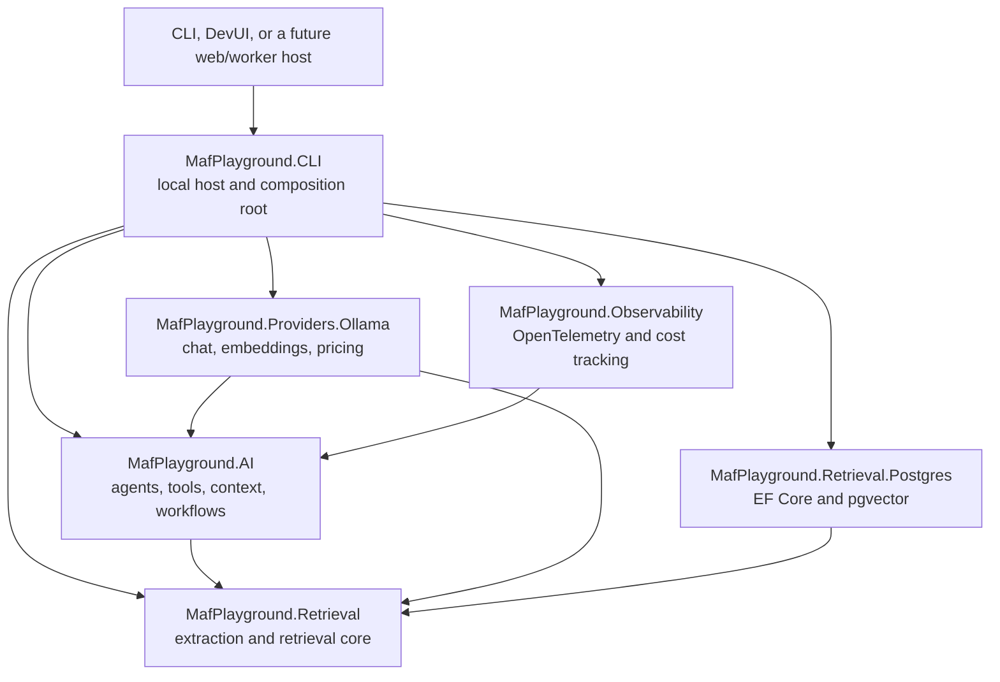

# MAF Playground

A production-oriented Microsoft Agent Framework (MAF) playground for building,
running, inspecting, and testing provider-neutral agents and native workflows in
C#/.NET.

The repository includes:

- a conversational agent with trusted user context and a reusable time tool;
- a grounded RAG agent with PDF ingestion, semantic retrieval, and mandatory
  citations;
- a translation workflow with parallel fan-out, validation, feedback retry, and
  ordered fan-in;
- a local CLI harness and DevUI host;
- OpenTelemetry logs, traces, metrics, and model-cost estimates;
- Ollama and PostgreSQL/pgvector as replaceable local adapters.

## Architecture

MAF is the orchestration layer. Model providers, storage, hosts, and telemetry
exporters stay outside reusable agent and workflow behavior.



| Concern | Implementation | MAF/application role |
| --- | --- | --- |
| Open-ended conversation | Basic and Basic RAG agents | `AIAgent` |
| Trusted user data | `UserContextProvider` | `AIContextProvider` |
| Current date/time | `CurrentDateTimeTool` | Deterministic tool/function |
| RAG evidence | `RagContextProvider` | Retrieval-backed context plus one narrow search tool |
| Citation enforcement | `CitationValidator` and agent middleware | Deterministic postcondition with bounded repair |
| Translation orchestration | Native translation graph | Workflow executors, typed messages, fan-out/fan-in edges |
| Timeouts and cost | Chat-client decorators | Provider-neutral cross-cutting infrastructure |
| Documents and vector search | Retrieval services and store ports | Deterministic application logic and persistence boundary |
| Local execution | CLI and DevUI commands | Development host, not reusable core |

## Projects

| Project | Responsibility |
| --- | --- |
| [`MafPlayground.AI`](src/MafPlayground.AI/README.md) | Provider-neutral MAF agents, workflows, tools, context, provider contracts, and resilience decorators. |
| [`MafPlayground.CLI`](src/MafPlayground.CLI/README.md) | Local command-line harness, DevUI host, entity inspection, and dependency composition. |
| [`MafPlayground.Observability`](src/MafPlayground.Observability/README.md) | OpenTelemetry registration and provider-neutral token-cost estimation. |
| [`MafPlayground.Providers.Ollama`](src/MafPlayground.Providers.Ollama/README.md) | Ollama chat, embedding, endpoint, and pricing adapters. |
| [`MafPlayground.Retrieval`](src/MafPlayground.Retrieval/README.md) | File-format-neutral ingestion, chunking, embedding, search, and storage contracts. |
| [`MafPlayground.Retrieval.Postgres`](src/MafPlayground.Retrieval.Postgres/README.md) | EF Core/PostgreSQL/pgvector implementation of the retrieval store. |
| [`MafPlayground.Tests`](tests/MafPlayground.Tests/README.md) | Fast deterministic unit and component tests. |
| [`MafPlayground.IntegrationTests`](tests/MafPlayground.IntegrationTests/README.md) | Explicitly opt-in tests that require external infrastructure. |

Detailed feature documentation:

- [Basic agent](src/MafPlayground.AI/Agents/BasicAgent/README.md)
- [Basic RAG agent](src/MafPlayground.AI/Agents/BasicRagAgent/README.md)
- [Translation workflow](src/MafPlayground.AI/Workflows/Translation/README.md)
- [Test organization](tests/README.md)

## Prerequisites

- .NET 10 SDK
- [Ollama](https://ollama.com/) for the included local provider adapter
- Docker with Compose for PostgreSQL/pgvector and the Aspire Dashboard

The solution pins MAF `1.16.0`; the .NET DevUI/hosting packages are preview
builds. Installed NuGet APIs are authoritative because MAF and DevUI evolve
quickly.

## Quick start: Basic agent

Start Ollama and pull the default chat model:

```bash
ollama serve
ollama pull llama3.1:8b
```

Copy and load the local environment:

```bash
cp .env.example .env
set -a; source .env; set +a
```

The application reads process environment variables; it does not load `.env`
automatically.

Start an interactive conversation:

```bash
dotnet run --project src/MafPlayground.CLI -- agent basic
```

Or run one prompt and stream execution diagnostics:

```bash
dotnet run --project src/MafPlayground.CLI -- \
  agent basic --prompt "What date and time is it for me?" --watch
```

The CLI supplies the machine's `TimeZoneInfo.Local.Id` as trusted local user
context. A production host must replace this with request-aware user context.

## Quick start: Basic RAG agent

The RAG example requires PostgreSQL, a chat model, an embedding model, database
migrations, and explicit document ingestion:

```bash
docker compose up -d postgres
ollama pull nomic-embed-text
dotnet run --project src/MafPlayground.CLI -- rag database migrate
dotnet run --project src/MafPlayground.CLI -- \
  rag ingest --path ./documents/help.pdf --source-root ./documents
dotnet run --project src/MafPlayground.CLI -- \
  agent basic-rag \
  --prompt "How long does a password-reset link remain valid?" \
  --watch
```

`documents/help.pdf` is a four-page fictional help guide with stable,
page-specific test facts. Ingestion extracts text, chunks it, generates semantic
embeddings, and writes them to pgvector. Answers must contain exact citations
from the current retrieval invocation. Textless PDF pages are reported; OCR is a
future extension behind `IDocumentExtractor`.

Read the [RAG architecture guide](src/MafPlayground.AI/Agents/BasicRagAgent/README.md)
for the full ingestion/query flow, state model, failure behavior, and extension
points.

## Quick start: translation workflow

```bash
dotnet run --project src/MafPlayground.CLI -- \
  workflow translate \
  --text "Hello, how are you?" \
  --languages es,fr,pt-BR \
  --watch
```

Requested languages are validated before model calls. Active branches translate
concurrently, semantic validators return typed reviews, invalid output can loop
back once with feedback, and the fan-in result preserves requested order. A
failed branch is returned as a partial failure rather than blocking other
languages.

## CLI command map

System.CommandLine provides help at every level:

```bash
dotnet run --project src/MafPlayground.CLI -- --help
dotnet run --project src/MafPlayground.CLI -- agent --help
dotnet run --project src/MafPlayground.CLI -- workflow translate --help
```

| Command | Purpose |
| --- | --- |
| `agent basic` | Run the Basic agent interactively or with `--prompt`. |
| `agent basic-rag` | Run the grounded RAG agent. |
| `workflow translate` | Execute the typed translation workflow. |
| `rag database migrate` | Apply EF Core retrieval migrations. |
| `rag ingest` | Extract, chunk, embed, and index one document explicitly. |
| `inspect list` | List locally registered agents and workflows. |
| `inspect agent <id> --view-input` | Print an agent's JSON Schema and example input. |
| `inspect workflow <id> --view-input` | Print a workflow's JSON Schema and example input. |
| `inspect workflow <id> --diagram` | Print the native MAF graph as Mermaid source. |
| `devui` | Host the local MAF DevUI. |

`--watch` is available on agent and workflow execution commands. It shows
lifecycle, tool, executor, and workflow events without printing sensitive payloads.
Standalone agent diagrams are intentionally out of scope because `AIAgent` does
not expose a native executor graph equivalent to a MAF workflow.

## DevUI

```bash
dotnet run --project src/MafPlayground.CLI -- devui
```

Open `http://localhost:5050/devui`. The registered entities are `basic-agent`,
`basic-rag-agent`, and the native `translation-workflow` graph.

The installed .NET DevUI preview exposes workflow input as a chat string. For the
translation workflow, enter:

```text
json:{"text":"Hello","targetLanguages":["es","fr"]}
```

The CLI contains a temporary adapter that unwraps the DevUI string envelope and
forwards a typed `TranslationWorkflowInput`. This can be removed when structured
workflow input is supported natively by the installed DevUI package.

DevUI tracing uses a local response-stream bridge. OTLP export is separate: the
same execution can appear in DevUI and an external dashboard independently.

## Configuration

The local host combines `appsettings.json`, process environment variables, and
command options. Command options take precedence where available.

| Setting | Purpose |
| --- | --- |
| `AI_MODEL` | Chat model selector in `provider:model` format. |
| `AI_EMBEDDING_MODEL` | Embedding selector in `provider:model` format. |
| `AI__PROVIDERS__OLLAMA__ENDPOINT` | Ollama endpoint. |
| `AI:Resilience:ModelCallTimeout` | Timeout applied by the shared chat-client decorator. |
| `AI:Retrieval:*` | Collection, vector dimension, chunking, and search settings. |
| `AI:Retrieval:Postgres:ConnectionString` | Current retrieval store connection. |
| `AI:Workflows:Translation:*` | Supported languages, limits, retries, and confidence. |
| `Observability:*` | OTLP enablement, service identity, sensitive-data policy, and cost tracking. |
| `DEVUI_URL` | Local DevUI listening URL. |

.NET configuration maps `__` in environment variables to `:`. Secrets and
production endpoints must come from environment variables, a secret store, or
the hosting platform rather than committed settings.

## Observability and local infrastructure

The root `compose.yaml` starts PostgreSQL/pgvector and the standalone Aspire
Dashboard:

```bash
# Set OBSERVABILITY__ENABLED=true in .env first.
docker compose up -d
set -a; source .env; set +a
dotnet run --project src/MafPlayground.CLI -- agent basic
```

Open Aspire Dashboard at `http://localhost:18888`. OTLP/gRPC is exposed at
`http://localhost:4317` and OTLP/HTTP at `http://localhost:4318`.

Telemetry includes structured logs, MAF agent/workflow traces, tool/model spans,
metrics, and an estimated `maf_playground.gen_ai.cost` when both provider pricing
and token usage are available. Rates use currency units per one million tokens:

```text
cost = (input tokens × input rate + output tokens × output rate) / 1,000,000
```

The configured local Ollama rate is synthetic for testing and is not a bill.
Prompt, response, tool, and retrieved-document payloads are excluded by default.

Stop local infrastructure without deleting its named PostgreSQL volume:

```bash
docker compose down
```

## Build and test

```bash
dotnet restore
dotnet format --verify-no-changes
dotnet build --no-restore
dotnet test --no-build
```

The default test project is deterministic and does not require a model or
containers. PostgreSQL integration tests are opt-in:

```bash
RAG_TEST_CONNECTION_STRING='Host=localhost;Database=maf_playground;Username=postgres;Password=postgres' \
  dotnet test tests/MafPlayground.IntegrationTests
```

Without `RAG_TEST_CONNECTION_STRING`, the database test is reported as skipped.

## Extending the playground

- Add a model provider by implementing `IChatClientProvider`; add embeddings with
  `IEmbeddingGeneratorProvider`; keep SDK types inside a `Providers.*` adapter.
- Add a document type by implementing and registering `IDocumentExtractor`.
- Replace pgvector by implementing `IKnowledgeStore` and
  `IRetrievalDatabaseInitializer` in another infrastructure project.
- Add an agent for open-ended semantic behavior; put deterministic capabilities
  in typed tools and services.
- Add a workflow when ordering, branching, concurrency, validation, retry,
  approval, or durable transitions must be explicit.
- Add a web or worker host as a new composition root. Do not make reusable
  projects depend on the CLI or DevUI.

Repository-specific implementation and review guidance is in [`AGENTS.md`](AGENTS.md)
and the MAF skills under [`.agents/skills`](.agents/skills).

## Current limitations

- DevUI packages are preview and its structured workflow input is adapted through
  a temporary chat protocol.
- The RAG schema currently fixes vectors at 768 dimensions.
- PDF extraction supports text only; OCR and additional formats are pending.
- RAG uses one shared collection without tenant, ACL, or metadata filters.
- The CLI and DevUI are local development tools, not secured production hosts.
- The Aspire Dashboard stores telemetry in memory and local anonymous access is
  enabled by default for convenience.
