# RAG data-ingestion spike

## Status

- Branch: `spike-openxml-document-readers`
- Base: `main` at `6ab35500155d84c9c12b26a57f245e57689398bf`
- Scope: PDF, DOCX, PPTX, and Markdown reading plus token-aware chunking
- Explicit non-goal: replacing EF Core, PostgreSQL, pgvector, or `IKnowledgeStore`

## Decision summary

The spike confirms that `Microsoft.Extensions.DataIngestion` can be introduced at
the extraction and chunking boundary without changing the existing embedding,
idempotency, storage, search, or RAG-agent layers.

The recommended production direction is incremental adoption of the
DataIngestion exchange model and extension points. Keep the existing ingestion
coordination and EF Core store, implement critical readers behind
`IngestionDocumentReader`, and isolate the preview dependency to the retrieval
ingestion boundary until its compatibility guarantees stabilize.

DOCX and PPTX use native repository-owned readers over the stable Open XML SDK.
MarkItDown was explicitly not adopted, so the ingestion deployment has no Python,
MarkItDown executable, MCP server, or Office installation requirement.

## Architecture

```mermaid
flowchart LR
    Source[PDF, DOCX, PPTX or Markdown] --> Reader[IngestionDocumentReader implementation]
    Reader --> Document[Structured IngestionDocument]
    Document --> Coordinator[Existing ingestion coordinator]
    Coordinator --> Chunker[Repository token splitter per source section]
    Chunker --> ExistingChunks[DocumentChunk]
    ExistingChunks --> Embeddings[IEmbeddingGenerator]
    Embeddings --> Store[Existing IKnowledgeStore]
    Store --> EfCore[Existing EF Core and pgvector adapter]
```

The ingestion path remains deterministic application code. No agent or MAF
workflow was added. A MAF workflow would only be justified later for explicit
batch state, retries, checkpoints, or resumability.

## What the spike changed

### Packages

The spike pins packages compatible with the repository's
`Microsoft.Extensions.AI` 10.7 line:

- `Microsoft.Extensions.DataIngestion` `10.7.0-preview.1.26309.5`
- `Microsoft.Extensions.DataIngestion.Abstractions`
  `10.7.0-preview.1.26309.5` (transitive)
- `Microsoft.Extensions.DataIngestion.Markdig` `10.7.0-preview.1.26309.5`
- `Microsoft.ML.Tokenizers` `2.0.0` (retrieval contract and BERT implementation)
- `Microsoft.ML.Tokenizers.Data.Cl100kBase` `1.0.1` (tests only)
- `DocumentFormat.OpenXml` `3.5.1`

The retrieval core depends only on the async tokenizer abstraction. Each
embedding provider supplies local or remote token-boundary operations and a
stable identity that participates in the chunking identity. For supported
`nomic-embed-text` aliases,
the Ollama adapter requests verbose `/api/show` metadata, builds a BERT tokenizer
from the installed GGUF vocabulary, and includes the vocabulary hash in that
identity. Unknown Ollama models fail explicitly instead of using an approximation.

### Reading

`ExtractedDocument` now carries the structured `IngestionDocument` plus
repository-owned title and diagnostic warnings. It no longer flattens every
source to `ExtractedDocumentSection`. The Microsoft type is deliberately limited
to the retrieval ingestion boundary and does not enter persistence entities or
application-facing knowledge contracts.

`MarkdownDocumentExtractor` preserves the `IngestionDocument` returned by the
official Markdig `MarkdownReader`. `PdfDocumentExtractor` is a repository-owned
implementation of `IngestionDocumentReader` over PdfPig. It creates one
`IngestionDocumentSection` per page and paragraph elements carrying page
numbers.

The PDF implementation no longer reads `page.Text`, whose internal PDF content
order is not normally reading order. It extracts words with
`NearestNeighbourWordExtractor`, segments them into text blocks with
`DocstrumBoundingBoxes`, and orders those blocks with
`UnsupervisedReadingOrderDetector`. `ContentOrderTextExtractor` is retained as a
fallback when block analysis produces no paragraphs. Empty page sections remain
available for diagnostics and trigger OCR warnings. This improves digitally
generated PDFs but does not add OCR, table reconstruction, header/footer
removal, or semantic layout classification.

`DocxDocumentExtractor` reads WordprocessingML directly with Open XML SDK. It
creates logical sections at Word heading styles, represents ordinary paragraphs
and list items as paragraph elements, and converts tables to
`IngestionDocumentTable`. It intentionally ignores Word pagination because DOCX
does not define a stable rendered page number. Document images produce explicit
warnings and are not interpreted.

`PptxDocumentExtractor` reads PresentationML directly. Every slide becomes one
section whose `PageNumber` is the slide number. Title placeholders become
headers, other text shapes become paragraphs, and DrawingML tables become
`IngestionDocumentTable`. Images, charts, and speaker notes produce explicit
warnings until dedicated extractors exist.

### Chunking

`IDocumentChunker` keeps chunking replaceable and asynchronous. The application
registers `MicrosoftDataIngestionDocumentChunker` as its only chunker; the
previous character-based implementation and its configuration were removed.

The Microsoft adapter:

1. receives the reader's `IngestionDocument` without flattening it;
2. performs normalized token splitting independently per original section;
3. maps chunks back to the existing `DocumentChunk` contract;
4. preserves page number and header context from the source;
5. carries provider tokenizer identity, size, overlap, strategy, and package version in the
   chunking identity so existing documents are reindexed when the strategy
   changes.

Chunk content is not trimmed after tokenization. Leading whitespace can affect
token boundaries; normalizing it after chunk creation can make a chunk count
differently from the limit used by the tokenizer.

### Persistence

No files in `MafPlayground.Retrieval.Postgres` were changed. The following remain
the source of truth:

- `IKnowledgeStore`
- `PostgresKnowledgeStore`
- `KnowledgeDbContext`
- EF Core migrations
- atomic document replacement transaction
- pgvector search and metadata filtering

`VectorStoreWriter<T>` and `Microsoft.Extensions.VectorData` were deliberately
not adopted.

## Findings

### Confirmed benefits

- Chunk size and overlap are expressed in tokens instead of characters.
- Markdown becomes a supported source through an official reader.
- DOCX and PPTX become supported through native .NET readers without an external
  conversion process.
- Existing page-level PDF citation metadata survives chunking.
- The embedding and persistence layers require no redesign.
- Chunking strategy versioning integrates with the existing idempotent reingest
  behavior.

### Limitations found during the spike

1. All DataIngestion packages used here, including
   `Microsoft.Extensions.DataIngestion.Abstractions`, are preview packages. The
   abstractions are the intended implementation boundary, but the current
   package version does not yet provide a GA compatibility guarantee.
2. Tokenizer metadata must be available from the installed Ollama model through
   verbose `/api/show`; ingestion fails clearly when it is absent.
3. The preview `DocumentTokenChunker` forces token index calculations without
   normalization, which violates chunk limits for BERT/WordPiece tokenizers.
   The repository adapter therefore owns the small splitting loop while retaining
   the DataIngestion document model and provider-supplied tokenizer.
4. Processing one source section at a time preserves pages but prevents chunks
   from crossing page boundaries. This is desirable for citations, but should be
   evaluated for documents whose paragraphs span pages.
5. The new document boundary can retain tables, images, nested sections, and
   metadata. The PDF reader currently produces only page sections and paragraphs;
   Office readers produce headings, paragraphs, and tables but do not interpret
   images or charts.
6. The Ollama adapter intentionally supports only known `nomic-embed-text`
   aliases. Adding another embedding model requires an explicit tokenizer
   implementation and contract tests.
7. `IngestionPipeline<T>` was not adopted because its writer boundary would
   bypass or duplicate the repository's document-level hash, metadata,
   idempotency, and atomic EF Core replacement semantics.

## Production migration plan

### Phase 1: evaluate this adapter

- Build a representative PDF and Markdown evaluation corpus.
- Evaluate the token chunker using Recall@K, MRR, citation accuracy, retrieved
  token count, latency, and index size.
- Include tables, long pages, headings, repeated text, scanned PDFs, and content
  spanning page boundaries.
- Tune `MaxTokensPerChunk` and `OverlapTokens` based on those results.

Exit criterion: token chunking improves retrieval quality or cost without
regressing citation fidelity.

### Phase 2: improve readers and extraction quality

- Keep `IngestionDocument` as the normalized representation inside the retrieval
  ingestion boundary; do not expose it through persistence or agent contracts.
- Evaluate and tune the PdfPig word extraction, Docstrum segmentation, and
  unsupervised reading-order strategy against the representative corpus.
- Add repeated header/footer removal and table-aware elements where the
  evaluation corpus requires them.
- Add readers one format at a time and contract-test each reader against golden
  documents.
- Add deterministic extraction-quality checks and route scanned or low-quality
  documents to an OCR-capable `IngestionDocumentReader` adapter.
- Keep OCR, Docling, and external document services optional and behind
  replaceable reader adapters. Do not introduce MarkItDown unless this explicit
  architectural decision changes.

Exit criterion: supported formats retain the structure needed for the selected
chunking policies.

### Phase 3: resilient batch coordinator

- Add deterministic discovery and per-document results.
- Bound concurrency and embedding batches.
- Add external-call timeouts and transient-only retries.
- Record pending, succeeded, skipped, and failed document states.
- Add tracing for read, chunk, embed, and store stages.
- Use a MAF workflow only if checkpointed resume or explicit state transitions
  are required; otherwise retain a normal C# application service.

Exit criterion: one document failure does not lose successful work and an
interrupted batch can be safely retried without duplicate state.

### Phase 4: rollout and reindex

- Treat the changed chunking identity as a required full reindex.
- Build a new collection alongside the current collection.
- Run retrieval evaluations against both.
- Switch configuration only after acceptance criteria pass.
- Retain the previous collection for rollback during a defined window.

## Test plan

The spike adds deterministic tests for:

- token limits and overlap behavior;
- page and section preservation;
- Markdown header/content extraction;
- DOCX heading, paragraph, list, and table extraction;
- PPTX slide, title, and body extraction;
- DOCX section and PPTX slide metadata surviving token chunking;
- chunking identity versioning.

Verification completed on the spike branch:

- `dotnet format MafPlayground.slnx --no-restore --verify-no-changes`
- `dotnet build MafPlayground.slnx --no-restore -m:1 /nodeReuse:false`
  completed with zero warnings and zero errors;
- `dotnet test MafPlayground.slnx --no-build --no-restore -m:1
  /nodeReuse:false` passed 158 unit tests; nine opt-in integration tests were
  skipped by their existing configuration.
- The live `NomicTokenizer_ChunksAndEmbedsWithInstalledModelMetadata` contract
  test passed against Ollama with the installed `nomic-embed-text` model.

Before production adoption, add:

- golden extraction tests per document format;
- PDF reading-order, columns, repeated header/footer, table, and empty-page cases;
- cancellation during chunking;
- concurrent ingestion of the same source;
- batch partial failure, retry, and resume;
- PostgreSQL round-trip tests with the new chunk identities;
- opt-in retrieval evaluations over a labeled corpus.

## Recommendation

Do not merge this spike as a transparent dependency replacement. Use it as the
baseline for a measured Phase 1 evaluation. If the evaluation succeeds, retain
the adapter boundary and EF Core store, then harden configuration, observability,
and batch behavior before enabling the new chunker by default in production.
