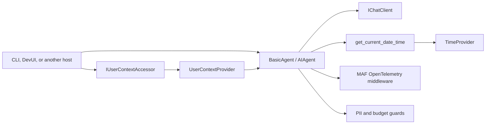

# Basic agent

`basic-agent` is the smallest conversational Microsoft Agent Framework (MAF)
example in this repository. It combines a provider-neutral chat model, trusted
application context, a deterministic tool, and OpenTelemetry instrumentation
without placing host or provider setup inside the agent.

## Architecture



| Component | Kind | Responsibility |
| --- | --- | --- |
| [`BasicAgent.cs`](./BasicAgent.cs) | Agent composition | Defines the identity, instructions, tools, context providers, and telemetry middleware. |
| [`UserContextProvider.cs`](../../Context/UserContextProvider.cs) | MAF context provider | Adds trusted, host-supplied user context to each invocation. |
| [`UserContext.cs`](../../Context/UserContext.cs) | Application contract | Represents context as a generic key/value bag exposed through `IUserContextAccessor`. |
| [`CurrentDateTimeTool.cs`](../../Tools/CurrentDateTimeTool.cs) | Deterministic tool | Resolves the exact date and time for a required time-zone identifier. |
| `IChatClient` | Provider-neutral model boundary | Supplies the model used by MAF; dependency injection resolves the provider outside this folder. |

## Request flow

1. The host resolves an `IChatClient` from a selector such as
   `ollama:llama3.1:8b` and creates the agent through dependency injection.
2. Before a model invocation, `UserContextProvider` serializes the current
   host-owned context as JSON and adds it to the MAF invocation context.
3. The model answers directly or calls `get_current_date_time` when the answer
   depends on an exact date or time.
4. The tool requires a time-zone ID. For a user-relative request, the model uses
   the trusted `time_zone` context value; it must not guess one when it is absent.
5. The tool uses `TimeProvider`, converts the UTC instant with `TimeZoneInfo`, and
   returns a typed `CurrentDateTimeResult`.
6. Agent instructions require exact dates, numbers, identifiers, amounts, and
   units returned by tools to be preserved in the final answer.
7. The selected guard profile inspects input/output, counts tool calls, and
   applies one shared budget to every model turn in the run.

The CLI's local `IUserContextAccessor` supplies `TimeZoneInfo.Local.Id`. A web
host should replace it with a request-aware implementation derived from trusted
user or tenant data; the server's local time zone is not a user identity.

## Why context and the clock are separate

The user's time zone is contextual application data. Reading the clock and
performing a time-zone conversion is a deterministic capability. Keeping them
separate lets another host provide more context fields without growing the tool
contract, while the same clock tool remains reusable by other agents.

The tool intentionally does not use `DateTime.Now`. Its injected `TimeProvider`
makes time-dependent behavior deterministic in tests.

## Provider, host, and state boundaries

- The agent depends on `IChatClient`, not an Ollama- or cloud-specific SDK.
- Provider selection, endpoints, credentials, and decorators belong to the
  composition root and provider adapters.
- The reusable agent library does not depend on the CLI or DevUI.
- Conversation history belongs to the MAF agent session. User context is rebuilt
  for each invocation and is not long-term memory.
- The tool keeps no mutable global state.

## Run and inspect

Start an interactive session:

```bash
dotnet run --project src/MafPlayground.CLI -- \
  agent basic --model ollama:llama3.1:8b
```

Run one request and show lifecycle and tool-call events:

```bash
dotnet run --project src/MafPlayground.CLI -- \
  agent basic --prompt "What date and time is it for me?" --watch
```

Inspect the entity and its input contract:

```bash
dotnet run --project src/MafPlayground.CLI -- inspect agent basic-agent --view-input
```

It is also registered as `basic-agent` in the local DevUI host:

```bash
dotnet run --project src/MafPlayground.CLI -- devui
```

## Failure behavior

- Missing user-specific context is not guessed; the model is instructed to ask
  for it.
- A missing or unavailable time-zone identifier is rejected by the tool with an
  `ArgumentException`.
- Model timeouts are applied by the shared `IChatClient` resilience decorator,
  not by the agent or tool.
- Provider and host startup failures are handled by the host surface.
- PII can be allowed, redacted, or blocked independently at input, output, and
  tool boundaries. Strong output inspection intentionally produces buffered
  rather than token-by-token streaming.
- Budget exhaustion short-circuits before the next model or tool call.

## Testing and extension points

The unit tests cover agent instructions, context injection, exact tool values,
time-zone validation, and CLI interaction with a fake chat client. The main
extension points are additional narrow tools, new trusted context values, and a
host-specific `IUserContextAccessor`; none require changing the provider adapter.
