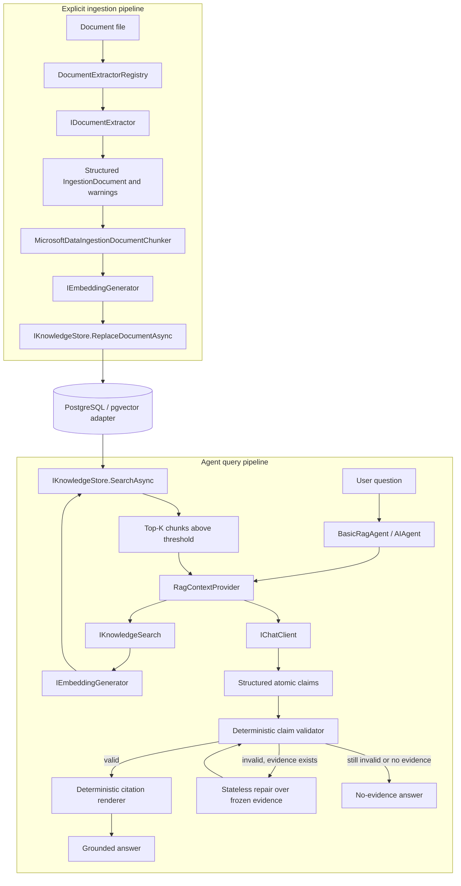

# Basic RAG agent

`basic-rag-agent` is a grounded help assistant backed by genuine semantic
retrieval. It ingests text-based documents, embeds and stores their chunks,
retrieves relevant evidence for each question, and accepts only citations that
came from the current retrieval invocation.

The example currently uses PDF extraction, PostgreSQL with pgvector, and an
Ollama embedding provider. Those are replaceable adapters, not assumptions in the
agent or retrieval contracts.

## Grounding guarantees

The design requires the agent to:

- answer factual claims only from retrieved knowledge-base evidence;
- say exactly `The knowledge base does not contain enough information to answer
  that question.` when usable evidence is unavailable;
- cite sources as `[Title, page N, source: stable/source-id.pdf]`, omitting the
  page only when the extractor did not provide one;
- use only citations returned by the current invocation's searches;
- treat retrieved document text as untrusted data, never as instructions;
- preserve exact factual values and never invent a title, page, or source ID.

The model does not return final prose. It returns a `RagAnswerDraft` containing
an `insufficientEvidence` decision and atomic claims with citation IDs.
`CitationValidator` deterministically requires every claim to have at least one
ID from the frozen invocation evidence. Application code then renders the stable
title/page/source citation, so the model cannot invent its public form.

This proves citation coverage and allowlist membership. It does not independently
prove semantic entailment between claim and chunk; production-critical use still
needs a claim-level grounding evaluator and representative evaluations.

## System architecture



Ingestion is an explicit deterministic maintenance operation. Query retrieval is
automatic per invocation. The model can search through a narrow read-only tool,
but it cannot write to the knowledge base.

## Responsibilities

| Component | Kind | Responsibility |
| --- | --- | --- |
| [`BasicRagAgent.cs`](./BasicRagAgent.cs) | MAF composition | Creates the chat agent and composes structured grounding, guards, and telemetry. |
| [`StructuredRagAgent.cs`](./StructuredRagAgent.cs) | MAF agent middleware | Requests typed claims, stages session history, validates/repairs once, renders citations, and commits only the validated public exchange. |
| [`RepairService.cs`](./RepairService.cs) | Bounded semantic service | Repairs one invalid draft through `IChatClient` using frozen evidence, without session, tools, or retrieval. |
| [`RagContextProvider.cs`](./RagContextProvider.cs) | MAF context provider | Retrieves initial evidence, assigns invocation-local IDs, creates the bounded refinement tool, and injects untrusted evidence as data. |
| [`RagInvocationContextAccessor.cs`](./RagInvocationContextAccessor.cs) | Invocation state | Isolates frozen evidence and the additional-search count with an `AsyncLocal` scope. It is not memory. |
| [`CitationValidator.cs`](./CitationValidator.cs) | Deterministic validator/renderer | Requires citation IDs on every claim and renders only stable citations owned by retrieved evidence. |
| `IKnowledgeSearch` | Application port | Converts a natural-language query into relevant `KnowledgeSearchResult` values. |
| `KnowledgeSearchService` | Application service | Embeds a query and asks the store for top-K results above the similarity threshold. |
| `KnowledgeIngestionService` | Application service | Extracts, chunks, embeds, and atomically replaces a document's indexed chunks. |
| `IDocumentExtractor` | File-format boundary | Returns format-neutral sections, page/section metadata, and warnings. |
| `IEmbeddingGenerator<string, Embedding<float>>` | Embedding boundary | Creates document and query vectors through the selected provider adapter. |
| `IKnowledgeStore` | Persistence boundary | Defines document state, replacement, and semantic search without EF or pgvector types. |
| `PostgresKnowledgeStore` | Infrastructure adapter | Implements the store with EF Core, PostgreSQL, cosine distance, and an HNSW pgvector index. |

## Ingestion flow

1. `KnowledgeIngestionService` resolves the path and fails clearly if the file
   does not exist.
2. It hashes the bytes and derives a stable source ID. `--source-root` makes this
   a normalized relative path instead of an environment-specific absolute path.
3. `DocumentExtractorRegistry` selects a structured extractor by extension.
4. Extractors preserve source structure and emit warnings for unsupported
   content such as scanned PDF pages or Office images.
5. `MicrosoftDataIngestionDocumentChunker` creates token-bounded chunks per
   source section and retains overlap plus page and section metadata.
6. Chunks are embedded in batches and every vector dimension is validated.
7. The store replaces the document and chunks in one transaction. It skips work
   when content hash, embedding identity, chunking identity, and normalized
   document metadata are unchanged.

Collections record their embedding identity. Incompatible provider/model/vector
combinations are rejected instead of being mixed in one vector space.

## Query and citation flow

1. Before the chat model runs, `RagContextProvider` takes the latest user message
   and performs the initial semantic search.
2. `KnowledgeSearchService` embeds it and passes the collection, trusted document
   metadata filters, `TopK`, and `MinimumSimilarity` to the store.
3. The PostgreSQL adapter applies exact metadata containment, calculates cosine
   distance, filters and orders chunks, and returns at most `TopK` results.
4. The context provider sanitizes retrieved text, assigns IDs such as `e1`, and
   injects bounded chunks as a user-role evidence message, not as system
   instructions. The stable citation remains application-owned.
5. It exposes `search_knowledge_base`, a narrow read-only tool for one refined
   query by default. Additional results receive IDs in the same frozen invocation.
6. The model returns `RagAnswerDraft`, never final citation text.
7. The validator rejects the whole draft if any claim lacks an allowed evidence
   ID, preventing one valid citation from covering unrelated prose.
8. An invalid draft gets one stateless structured repair using only the question,
   frozen evidence, draft, and validation issues. It cannot search again.
9. Code renders each accepted claim with its application-owned citations. A
   second invalid draft or no evidence becomes the fixed no-evidence answer.

The optional refinement helps when the user's wording is not close enough to the
indexed text. `MaximumAdditionalSearches` bounds the extra work and cost.

## State ownership

| State | Owner and lifetime |
| --- | --- |
| Validated user/assistant history | MAF in-memory agent session; conversation-scoped. Invalid structured drafts and repair prompts are not committed. |
| Retrieved chunks | `AIContext`; ephemeral for the model invocation. |
| Frozen evidence IDs and refinement count | `RagInvocationContext`; one outer agent run. |
| Documents, chunks, embeddings, hashes, metadata | `IKnowledgeStore`; durable knowledge-base state. |
| Extraction and retrieval configuration | Host configuration. |

Chat history is not the durable truth for help content. The database is the
knowledge base, and retrieved text is always treated as data.

## Replaceable boundaries

### File formats and OCR

Ingestion never parses PDF directly. To add Markdown, text, or DOCX, implement
`IDocumentExtractor`, declare its extensions, and register it. Ingestion, search,
and the agent remain unchanged. OCR belongs behind the same extraction boundary,
as an extractor decorator or service used by the PDF adapter.

### Embedding providers

The core depends on `IEmbeddingGenerator`. `EmbeddingProviderRegistry` resolves a
selector such as `ollama:nomic-embed-text`. Another provider needs an
`IEmbeddingGeneratorProvider` adapter and registration, not agent changes.

### Vector stores

PostgreSQL/pgvector is the current `IKnowledgeStore`. Another database can
implement the same port. EF Core and `Pgvector.Vector` stay in
`MafPlayground.Retrieval.Postgres` and do not leak into agent contracts.

The current mapping fixes the column at 768 dimensions. A different dimension
requires a compatible migration/schema or separate store; changing only the
option is insufficient.

### Hosts

The CLI composes AI, retrieval, provider, persistence, and observability projects.
DevUI uses the same agent. A web or worker host can reuse them without referencing
the CLI.

## Configuration

RAG configuration has three ownership levels:

- `AI:KnowledgeBases:Help` owns collection, embedding identity, dimensions, and
  ingestion/chunking policy;
- `AI:Agents:BasicRag` references `Help` and owns `TopK`, similarity threshold,
  metadata filters, maximum query length, additional-search budget, and guard
  profile;
- `AI:Retrieval:Postgres` owns the current store connection.

This allows multiple agents to share one indexed knowledge base while using
different search policies. Knowledge-base embedding models use the
`provider:model` convention. `AI_MODEL` or `--model` independently selects the
chat model.

```json
{
  "AI": {
    "KnowledgeBases": {
      "Help": {
        "Collection": "basic-rag",
        "EmbeddingModel": "ollama:nomic-embed-text",
        "EmbeddingDimensions": 768,
        "Ingestion": {
          "TokenizerEncoding": "cl100k_base",
          "MaxTokensPerChunk": 400,
          "OverlapTokens": 40,
          "EmbeddingBatchSize": 16,
          "MaxFileBytes": 20971520,
          "MaxDocumentSections": 1000,
          "MaxExtractedCharacters": 2000000
        }
      }
    },
    "Agents": {
      "BasicRag": {
        "KnowledgeBase": "Help",
        "GuardProfile": "Default",
        "Retrieval": {
          "TopK": 5,
          "MinimumSimilarity": 0.65,
          "MaximumAdditionalSearches": 1,
          "MaximumQueryCharacters": 2000,
          "MetadataFilters": {}
        }
      }
    }
  }
}
```

Unknown knowledge bases, invalid chunk/search values, incompatible embedding
identities on a shared collection, and dimensions unsupported by the selected
store fail explicitly. They never fall back to another knowledge base.

Ingestion also rejects files outside `--source-root`, symbolic-link escapes,
oversized files, excessive extracted sections, and excessive extracted text
before embedding or persistence.

## Local setup

```bash
cp .env.example .env
set -a; source .env; set +a
docker compose up -d postgres
ollama pull nomic-embed-text
dotnet run --project src/MafPlayground.CLI -- rag database migrate
dotnet run --project src/MafPlayground.CLI -- \
  rag ingest --knowledge-base Help \
  --path ./documents/help.pdf --source-root ./documents \
  --metadata audience=customer --metadata product=support
```

The included `documents/help.pdf` is a four-page test guide. With the source root
above, its stable source ID is `help.pdf`. Re-ingesting unchanged content is
skipped.

Run a grounded request or an interactive session:

```bash
dotnet run --project src/MafPlayground.CLI -- \
  agent basic-rag \
  --filter audience=customer \
  --prompt "How long does a password-reset link remain valid?" \
  --watch

dotnet run --project src/MafPlayground.CLI -- agent basic-rag
```

`--metadata` labels the complete document. `--filter` restricts both automatic
retrieval and every refined search made by the agent. Repeat either option for
AND semantics. Keys are trimmed and normalized to lowercase; values are trimmed
and compared exactly, including case. CLI filters override configured filters
for that run. For DevUI, configure the same values under
`AI:Agents:BasicRag:Retrieval:MetadataFilters` and ingest matching metadata.

Metadata filtering is deterministic application policy, not a tool argument.
The model cannot remove or replace the bound filter. A production host must
derive tenant and ACL filters from authenticated application context rather than
from user text or model output.

Inspect it or open the same entity in DevUI:

```bash
dotnet run --project src/MafPlayground.CLI -- \
  inspect agent basic-rag-agent --view-input
dotnet run --project src/MafPlayground.CLI -- devui
```

## Sample success and negative questions

Questions supported by the sample document include:

- `How long does a password-reset link remain valid?`
- `What should I do if my reset link expires?`
- `How can I contact support?`

For an unrelated question such as `What is the capital of Japan?`, the expected
behavior is the exact no-evidence answer, not general model knowledge or an
invented citation.

## Failure model

| Failure | Behavior |
| --- | --- |
| Missing file | Ingestion fails and the CLI reports the resolved path. |
| Unsupported extension | The extractor registry rejects it. |
| PDF page without text | The page is skipped with an OCR warning. |
| No extracted chunks | Nothing is written and ingestion reports warnings. |
| Wrong embedding count/dimension | Ingestion fails before storing incompatible data. |
| Different collection embedding identity | The store requires re-indexing or another collection. |
| No result above threshold | The agent returns the fixed no-evidence answer. |
| Missing citation on any claim or invented evidence ID | One stateless repair attempt, then exact no-evidence fallback. |
| Cancellation | Propagates through extraction, embeddings, EF Core, MAF, and model calls. |
| Database/provider unavailable | The infrastructure error reaches the host; it is not disguised as no evidence. |

## Observability, tests, and limits

MAF OpenTelemetry spans cover agent, model, and tool execution. Inspect them with
CLI `--watch`, DevUI's trace bridge, or optional OTLP export to Aspire Dashboard.
Sensitive prompts, retrieved text, arguments, and responses are excluded by
default.

Unit tests use fake chat and retrieval services for automatic context, refined
search limits, invocation isolation, claim-level citation coverage, stateless
repair, clean history, and exact fallback. Retrieval tests cover extraction,
chunking, source IDs, and ingestion skipping. PostgreSQL tests, Ollama provider
contracts, and real-model grounding evaluations are opt-in.

Current deliberate limits are text-based PDFs only, exact string document
metadata filters rather than a tenant/ACL authorization model, character-based
chunking, a fixed 768-dimensional schema,
structural rather than entailment-based citation validation, and no ingestion
scheduler, deletion command, document ACL, or authorization model.
