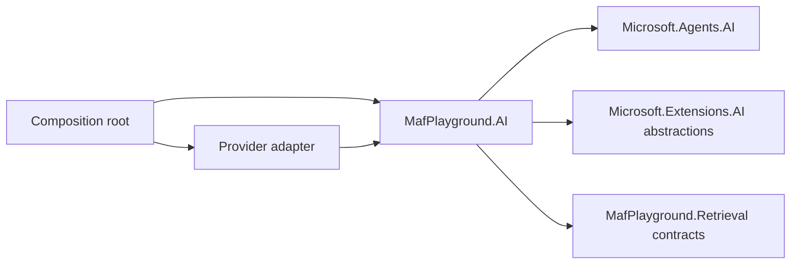

# MafPlayground.AI

Provider-neutral Microsoft Agent Framework agents, workflows, tools, context
providers, model-provider contracts, and model-call resilience.

This is the reusable orchestration project. It does not configure Ollama
endpoints, PostgreSQL, DevUI, OTLP exporters, or a specific hosting model.

## Responsibilities

| Area | Kind | Purpose |
| --- | --- | --- |
| `Agents/BasicAgent` | `AIAgent` | General conversation with trusted context and a deterministic date/time tool. |
| `Agents/BasicRagAgent` | `AIAgent`, context, middleware | Grounded answers from semantic retrieval with citation enforcement. |
| `Agents/RepositoryHelpAgent` | `AIAgent`, context, tools | Repository help with RAG, deterministic live-CLI evidence, and bounded command lookup tools. |
| `Workflows/Translation` | Native MAF workflow | Parallel translation, semantic validation, feedback retry, and fan-in. |
| `Tools` | Deterministic functions | Reusable application capabilities exposed to agents. |
| `Contracts` | Provider-neutral ports and data contracts | Shared interfaces for providers, decorators, pricing, and trusted user context. |
| `Observability` | Telemetry and instrumentation | AI operation metrics, agent telemetry options, and guard decision metrics. |
| `Context` | Context contract/provider | Adds bounded, trusted host data per invocation. |
| `Configuration` | Typed configuration value objects | Parses provider-qualified model selectors. |
| `Providers/AIProviderRegistry` | Adapter registry | Resolves provider-qualified chat models without provider SDK leakage. |
| `IChatClientDecorator` | Cross-cutting port | Composes timeout, cost, or future policies around `IChatClient`. |
| `Resilience` | Infrastructure-neutral middleware | Applies a configurable timeout to model calls. |
| `Guards` | Deterministic middleware and policies | Applies per-entity PII handling, input limits, tool limits, and shared model/token/cost budgets. |

## Dependency direction



Agents and workflows consume `IChatClient`, retrieval ports, typed options, and
repository-owned contracts. A provider swap should require only adapter
registration and configuration.

## Feature registrations

```csharp
services
    .AddAICore(modelSelection)
    .AddBasicRagAgent();
```

`AddAICore` registers the provider-neutral client pipeline, resilience, guards,
and shared contracts. A host then selects any combination of `AddBasicAgent`,
`AddBasicRagAgent`, `AddRepositoryHelpAgent`, and `AddTranslationWorkflow`.
`AddAIServices` remains a convenience aggregate for the core sample features.
Repository help is registered explicitly because its host must
also provide an `IRepositoryCliCommandCatalog` adapter.

`RepositoryCliContextProvider` keeps CLI routing outside the prompt: it adds
high-confidence live command evidence for lexical matches in the request or
retrieved CLI reference, and exposes `find_cli_commands` plus
`get_cli_command` as bounded fallbacks. The host adapter owns the live command
tree; the reusable AI project depends only on the catalog contract.
Live-command evidence marks its exact invocation as required inline code. The
shared grounded-answer validator rejects altered, omitted, or refused required
evidence and permits one bounded repair before returning the safe fallback.

Decorators have unique explicit order values. The effective call path is cost
telemetry, content guard, budget reservation, timeout, and finally the provider;
composition no longer depends on DI enumeration order. Typed options use
`ValidateOnStart` so a host fails during startup rather than during its first
request.

The host must also register:

- one or more `IChatClientProvider` implementations;
- `IUserContextAccessor` when the Basic agent is used;
- retrieval services and `IKnowledgeStore` when the RAG agent is used;
- configuration for guard profiles, `AIResilienceOptions`, telemetry, and workflow options.

`Configuration/AIModelSelection` uses `provider:model`. The parser splits only on the first
colon, so provider model names can contain additional colons.

## State and failure model

- Agent sessions own conversation history.
- Context providers construct invocation-scoped trusted or retrieved context.
- Translation branch records are workflow execution state.
- Durable documents and embeddings belong to `IKnowledgeStore`, not this project.
- Caller cancellation propagates. Shared timeout behavior wraps model calls.
- RAG produces structured atomic claims. Every claim requires evidence IDs, and
  code renders the public citations after one bounded stateless repair.
- Translation model failures become per-language partial failures.
- Agent runs and workflow branches share thread-safe budget ledgers. Retries,
  tool-induced model turns, and parallel branches consume the same run budget.
- PII policies inspect user input, retrieved content, tool arguments/results, and
  final output. The built-in regex inspector is a replaceable baseline, not a
  comprehensive DLP product.

## Guard pipeline

`AI:Guards:Profiles` defines reusable policies. Each agent or workflow selects a
profile through its own `GuardProfile` option. Agent guards use a MAF
`DelegatingAIAgent` plus function-invocation middleware; workflows carry an
internal execution ID so parallel branches enter the same guard context.

Monetary budgets use `IModelPricingSource`. `Hard` enforcement reserves a
pessimistic upper bound before a provider call and requires matching pricing;
`Soft` enforcement can continue without pricing but cannot guarantee a strict
monetary ceiling. Token and call limits remain deterministic in either mode.

Output PII inspection buffers an agent response before exposing it. This is
intentional: forwarding arbitrary streaming fragments before inspection cannot
guarantee that sensitive values never escape.

## Detailed documentation

- [Basic agent](Agents/BasicAgent/README.md)
- [Basic RAG agent](Agents/BasicRagAgent/README.md)
- [Repository help manual](../../docs/repository-help/manual.md)
- [Translation workflow](Workflows/Translation/README.md)

## Testing

Core behavior is tested with fake `IChatClient`, fake retrieval services, and
fake translation models in [`MafPlayground.Tests`](../../tests/MafPlayground.Tests/README.md).
Tests should validate contracts, state transitions, tool results, and invariants
rather than exact natural-language wording.

## Adding features

- Use ordinary C# for deterministic validation, routing, and transformations.
- Add a narrow tool only when an agent needs to invoke that capability.
- Add an agent for open-ended semantic behavior.
- Add a workflow for explicit ordering, branching, fan-out/fan-in, validation,
  retries, approvals, or resumability.
- Keep provider SDK types, credentials, endpoints, persistence entities, and host
  concerns outside this project.
