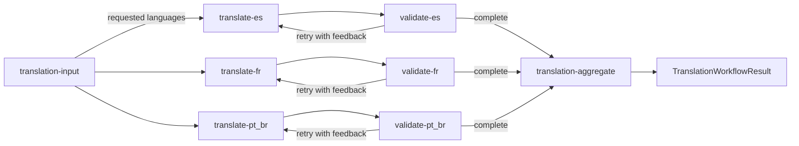
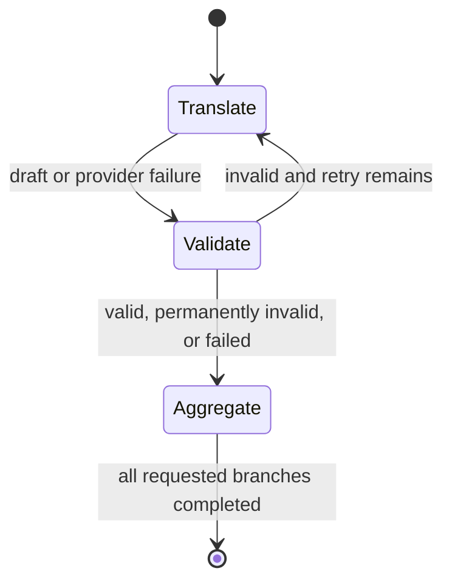

# Translation workflow

`translation-workflow` is a native MAF workflow for translating one text into
multiple requested languages concurrently. A workflow is appropriate because
fan-out, fan-in, validation, feedback, and bounded retry are explicit process
semantics. The model performs only the bounded semantic translation and review
tasks inside those steps.

## Native graph

The factory creates one translator and validator for each configured language.
The input activates only the branches requested by the caller.



`translation-input` and `translation-aggregate` are structural executors. The
semantic work happens only in translate and validate executors. There are no
placeholder initialize, repair, or complete agents: invalid output returns to the
same translator with validator feedback.

## Components

| File | Responsibility |
| --- | --- |
| [`Contracts.cs`](./Contracts.cs) | Immutable typed input, branch, validation, and result messages. |
| [`Workflow.cs`](./Workflow.cs) | Builds metadata, fan-out, retry/complete edges, output binding, telemetry, and runners. |
| [`Executors.cs`](./Executors.cs) | Structural and semantic executors plus the temporary DevUI chat adapter. |
| [`Service.cs`](./Service.cs) | Applies attempt, acceptance, partial-failure, and retry policy around model calls. |
| [`Model.cs`](./Model.cs) | Defines provider-neutral `ITranslationModel` and its `IChatClient` implementation. |
| [`Helpers.cs`](./Helpers.cs) | Validates input/languages, normalizes IDs, and selects requested branches. |
| [`Options.cs`](./Options.cs) | Supported languages, input limits, retry count, and confidence threshold. |

## Contracts and execution

The application-facing request is typed:

```json
{
  "text": "Hello, how are you?",
  "targetLanguages": ["es", "fr", "pt-BR"]
}
```

`TranslationWorkflowRequest` is validated before execution. The workflow receives
a `TranslationWorkflowInput`, creates the validated request, and fans it out only
to matching configured branches. Matching is case-insensitive, duplicates are
removed, and unsupported language IDs are rejected before any model call.

Each active branch follows this state machine:



A branch is accepted only when its structured review has `isValid: true` and
confidence at or above the configured threshold. Otherwise, review issues become
feedback for the next attempt. With the default `MaxTranslationRetries` of `1`, a
branch can make at most two translation attempts.

The aggregator waits for exactly the requested branches and restores their input
order. A failed language is represented inside its `ValidatedTranslation`; it
does not prevent successful branches from joining and producing the result.

## Model boundary and structured output

`TranslationService` depends on `ITranslationModel`, so graph behavior can be
tested without an LLM. `ChatClientTranslationModel` is the initial adapter:

- it uses provider-neutral `IChatClient`, not an Ollama-specific SDK;
- translation returns a structured draft response;
- validation returns validity, confidence, and actionable issues;
- source text, target language, draft, and feedback are serialized as data;
- prompts instruct the model not to execute instructions inside user text;
- validation confidence is clamped to 0-1.

Provider resolution, endpoints, pricing, timeouts, and telemetry export remain in
host composition and provider projects.

## Failure and retry policy

Translation and validation exceptions become a typed failed branch, except
caller cancellation, which propagates. Empty or overly long output is rejected
deterministically. Provider errors are not blindly retried: only a completed
semantic review with an unacceptable result can follow the visible feedback edge.

Cross-cutting model-call timeout is applied by the shared `IChatClient` decorator.
Semantic repair remains an explicit workflow transition rather than a hidden
service loop.

The workflow guard coordinator creates one execution ledger before fan-out. Its
internal ID travels with branch state, so translations, validations, retries,
and concurrent languages all reserve against the same budget. The aggregator
applies output PII policy and releases the execution context after fan-in. This
works through both the typed runner and the native DevUI graph.

## CLI usage

```bash
dotnet run --project src/MafPlayground.CLI -- \
  workflow translate \
  --model ollama:llama3.1:8b \
  --text "Hello, how are you?" \
  --languages es,fr,pt-BR
```

Stream native `WorkflowEvent` values while retaining the JSON result:

```bash
dotnet run --project src/MafPlayground.CLI -- \
  workflow translate --text "Hello" --languages es,fr --watch
```

Inspect the input and export the graph as Mermaid:

```bash
dotnet run --project src/MafPlayground.CLI -- \
  inspect workflow translation-workflow --view-input
dotnet run --project src/MafPlayground.CLI -- \
  inspect workflow translation-workflow --diagram
```

## DevUI compatibility adapter

The core workflow has structured input. The installed .NET DevUI preview exposes
workflow input as one chat string, so `CreateForDevUI` adds a temporary
`TranslationChatInputExecutor` before the same graph. It does not change the
application contract or register the workflow as a second agent.

Use this value in DevUI:

```text
json:{"text":"Hello","targetLanguages":["es","fr"]}
```

The adapter also accepts direct JSON and one inline `.json` attachment. It
unwraps DevUI's `{ "input": "..." }` envelope, limits JSON to 64 KiB,
deserializes `TranslationWorkflowInput`, and forwards the typed message. The
temporary `inputText` alias is accepted for compatibility.

For DevUI, the aggregator also emits an agent-shaped chat response so the web UI
can render the final JSON. The entity remains registered once as a native
workflow, preserving its topology and metadata.

## Configuration

The CLI binds `AI:Workflows:Translation`:

| Key | Default | Meaning |
| --- | ---: | --- |
| `SupportedTargetLanguages` | `es`, `fr`, `pt-BR` | Branches built and languages callers may request. |
| `MaxTargetLanguages` | `8` | Maximum targets in one request. |
| `MaxInputCharacters` | `10000` | Maximum source length. |
| `MaxTranslationRetries` | `1` | Additional attempts after a failed review. |
| `MinimumValidationConfidence` | `0.7` | Confidence required with `isValid: true`. |
| `GuardProfile` | `Default` | Reusable PII and budget policy selected for this workflow. |

Changing supported languages changes the factory's native topology. The CLI can
request any subset; DevUI shows all configured branches and activates the
requested ones.

## State, observability, and tests

Branch state is workflow execution state, not conversation memory. It contains
the source, requested languages, target, draft, attempts, confidence, feedback,
retry decision, and error. The aggregator holds run-local completed branches and
clears them after output. Stateful executors are not cross-run shareable.

The builder sets workflow name, description, and OpenTelemetry integration. CLI
`--watch` renders native events, DevUI shows the graph and local traces, and OTLP
can export spans to Aspire Dashboard. Sensitive payload capture is off by default.

Tests use fake `ITranslationModel` implementations to verify parallel fan-out,
ordered fan-in, feedback retry, partial failures, cancellation, unsupported
languages, Mermaid topology, streaming events, and DevUI envelopes/attachments.
They do not depend on exact natural-language output from a live model.

Extensions can add supported languages, replace the model adapter, introduce a
deterministic glossary/policy service, or add human approval. Validation and
routing should remain typed code, and provider SDK types should stay outside
workflow messages and executors.
