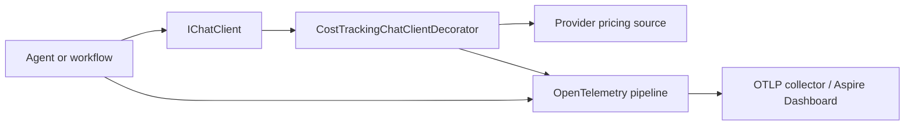

# MafPlayground.Observability

Reusable OpenTelemetry registration and provider-neutral model-cost estimation.
This project configures collection/export; agents and workflows emit their own MAF
instrumentation from `MafPlayground.AI`.

## Responsibilities

- bind and validate observability options;
- export structured logs, traces, and metrics through OTLP;
- subscribe to agent, workflow, and local harness activity sources;
- register a chat-client decorator for cost estimation when enabled;
- keep provider pricing behind `IModelPricingSource`.



## Registration

```csharp
services.AddMafPlaygroundObservability(configuration);
```

When `Observability:Enabled` is false, options are registered but exporters and
the cost decorator are not. When enabled, `ServiceName` must be non-empty.

## Configuration

```json
{
  "Observability": {
    "Enabled": true,
    "ServiceName": "maf-playground-cli",
    "AgentFramework": {
      "EnableSensitiveData": false
    },
    "Cost": {
      "Enabled": true
    }
  }
}
```

The standard OpenTelemetry environment variables configure the exporter, for
example `OTEL_EXPORTER_OTLP_ENDPOINT` and `OTEL_EXPORTER_OTLP_PROTOCOL`.

## Cost estimation

Providers expose normalized rates through `IModelPricingSource`. The decorator
matches the selected provider/model and uses provider-reported input/output token
usage:

```text
cost = (input tokens × input rate + output tokens × output rate) / 1,000,000
```

It records the `maf_playground.gen_ai.cost` histogram and span attributes for
currency and pricing version. No estimate is emitted when pricing or token usage
is unavailable. Estimates are telemetry, not authoritative billing records.

## Privacy and boundaries

Sensitive prompt, response, tool argument, and tool result capture is disabled by
default. Enable it only in a secured development environment with an appropriate
retention policy. Pricing configuration belongs to provider adapters; this
project contains no provider SDK or provider-specific configuration schema.

DevUI response-linked tracing is implemented in the CLI because it is a local
hosting integration. It is independent from OTLP export in this project.

## Testing

Tests verify disabled/enabled registration, resource/source configuration, cost
calculation, missing usage/pricing behavior, and sensitive-data defaults without
requiring an OTLP collector.

