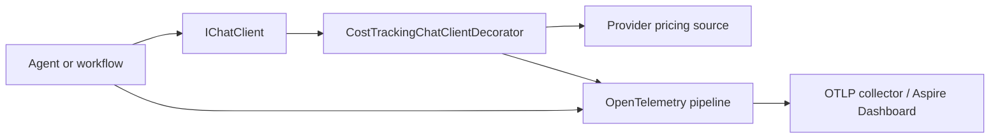

# MafPlayground.Observability

Reusable OpenTelemetry registration and provider-neutral model-cost estimation.
This project configures collection/export; agents and workflows emit their own MAF
instrumentation from `MafPlayground.AI`.

## Responsibilities

- bind and validate observability options;
- export structured logs, traces, and metrics through OTLP;
- subscribe to agent, workflow, and local harness activity sources;
- export application operation counts, failures, and durations;
- register a chat-client decorator for cost estimation when enabled;
- keep provider pricing behind `IModelPricingSource`.



## Registration

```csharp
services.AddMafPlaygroundObservability(configuration);
```

When `Observability:Enabled` is false, options are registered but exporters and
the cost decorator are not. When enabled, `ServiceName` must be non-empty.

## Configuration

```json
{
  "Observability": {
    "Enabled": true,
    "ServiceName": "maf-playground-cli",
    "AgentFramework": {
      "EnableSensitiveData": false
    },
    "Cost": {
      "Enabled": true
    }
  }
}
```

The standard OpenTelemetry environment variables configure the exporter, for
example `OTEL_EXPORTER_OTLP_ENDPOINT` and `OTEL_EXPORTER_OTLP_PROTOCOL`.

## Operations and failures

MAF's OpenTelemetry agent records model and tool spans. Model failures also
produce the standard `gen_ai.client.operation.duration` metric with a stable
`error.type` attribute.

Handled application operations use the provider-neutral
`MafPlayground.AI.Operations` activity source and meter. Translation branches
emit one child span per translate and validate attempt; these spans retain the
operation, language, attempt, outcome, and stable error type without recording
the source or translated text.

| Metric | Meaning |
| --- | --- |
| `maf_playground.ai.operation.count` | Every recorded application operation, grouped by outcome. |
| `maf_playground.ai.operation.failure.count` | Failed, timed-out, or rejected operations only. |
| `maf_playground.ai.operation.duration` | Operation duration in seconds, including failures. |

These metrics cover local harness turns and translation executor operations.
This is important for partial workflow failures: the workflow can return a typed
partial result while the failed branch span and failure metric still identify
the operation, branch, outcome, and stable error category. Exception messages,
prompt content, and tool arguments are not metric attributes.

## Cost estimation

Providers expose normalized rates through `IModelPricingSource`. The decorator
matches the selected provider/model and uses provider-reported input/output token
usage:

```text
cost = (input tokens × input rate + output tokens × output rate) / 1,000,000
```

It records the `maf_playground.gen_ai.cost` histogram and span attributes for
currency and pricing version. No estimate is emitted when pricing or token usage
is unavailable. Estimates are telemetry, not authoritative billing records.

The histogram records one measurement per actual model call. Its aggregated
`sum` over the selected time series includes bounded retries, the follow-up turn
after a tool result, and calls made by parallel workflow branches. For one
execution, sum the cost attributes of model-call spans sharing its trace. No
second parent-total measurement is emitted, which avoids double counting. A
deterministic tool has no model cost of its own. If a tool calls a paid external
service, that service needs separate cost instrumentation rather than being
inferred from chat token usage.

## Privacy and boundaries

Sensitive prompt, response, tool argument, and tool result capture is disabled by
default. Enable it only in a secured development environment with an appropriate
retention policy. Pricing configuration belongs to provider adapters; this
project contains no provider SDK or provider-specific configuration schema.

DevUI response-linked tracing is implemented in the CLI because it is a local
hosting integration. It is independent from OTLP export in this project.

## Testing

Tests verify disabled/enabled registration, resource/source configuration,
model/tool/timeout/workflow error spans, error metrics, DevUI error mapping, cost
calculation, aggregation across retries, tool-call turns and parallel workflow
branches, missing usage/pricing behavior, and sensitive-data defaults without
requiring an OTLP collector.
