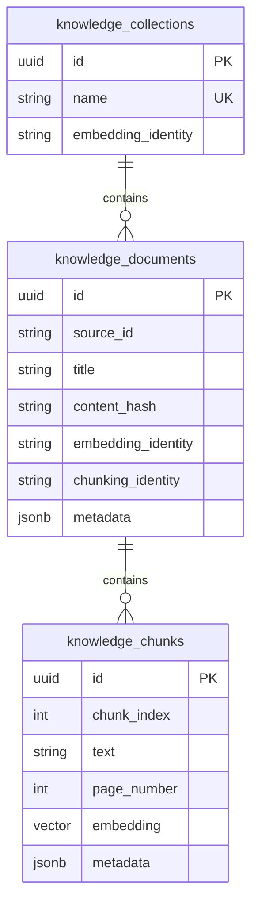

# MafPlayground.Retrieval.Postgres

EF Core, PostgreSQL, and pgvector infrastructure adapter for
`MafPlayground.Retrieval`.

This project owns database entities, mappings, migrations, connection options,
and vector-query translation. Those types do not leak into retrieval contracts or
the RAG agent.

## Implementation

| Component | Responsibility |
| --- | --- |
| `KnowledgeDbContext` | Maps collections, documents, chunks, JSON metadata, pgvector columns, and indexes. |
| `PostgresKnowledgeStore` | Implements document state lookup, transactional replacement, and cosine search. |
| `PostgresRetrievalDatabaseInitializer` | Applies EF Core migrations. |
| `PostgresRetrievalOptions` | Owns the PostgreSQL connection string. |
| `Migrations/` | Versioned schema including the `vector` extension and HNSW index. |

## Schema



Search uses cosine distance, filters by collection and configured minimum
similarity, orders nearest chunks first, and applies `TopK`. Document replacement
runs in a transaction and cascades old chunks.

## Registration and configuration

```csharp
services.AddPostgresRetrieval(configuration);
```

Configuration path:

```text
AI:Retrieval:Postgres:ConnectionString
```

The committed default targets the local Compose database only. Production hosts
must supply credentials through environment variables or a secret store.

## Local commands

```bash
docker compose up -d postgres
dotnet run --project src/MafPlayground.CLI -- rag database migrate
dotnet run --project src/MafPlayground.CLI -- \
  rag ingest --path ./documents/help.pdf --source-root ./documents
```

The schema currently maps `vector(768)`. The configured embedding model must
produce 768 values. Supporting another dimension requires a compatible schema
migration or separate store design, not only an options change.

Collections persist embedding identity and reject incompatible writes. Changing
the embedding model may require a new collection or explicit re-indexing even
when dimensions match, because different models do not share a vector space.

## Reliability and tests

Each operation creates a pooled `KnowledgeDbContext`; async EF APIs receive the
caller cancellation token. Replacement is transactional, unique indexes protect
collection names and chunk identity, and infrastructure failures surface to the
host rather than becoming false no-evidence answers.

The round-trip test is opt-in and documented in
[`MafPlayground.IntegrationTests`](../../tests/MafPlayground.IntegrationTests/README.md).
