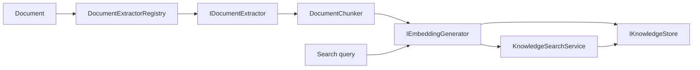

# MafPlayground.Retrieval

Provider- and persistence-neutral document ingestion and semantic retrieval core.
It contains deterministic application services and ports; it does not know about
MAF agents, DevUI, PostgreSQL entities, or a concrete embedding provider SDK.

## Architecture



## Main contracts and services

| Component | Responsibility |
| --- | --- |
| `IDocumentExtractor` | Converts one supported format into neutral sections, metadata, and warnings. |
| `DocumentExtractorRegistry` | Resolves exactly one extractor by normalized extension. |
| `PdfDocumentExtractor` | Initial text-only PDF adapter; reports pages that need OCR. |
| `DocumentChunker` | Normalizes and overlaps character-bounded chunks while preserving page/section metadata. |
| `IEmbeddingGeneratorProvider` | Provider adapter port for embedding models. |
| `EmbeddingProviderRegistry` | Resolves `provider:model` embedding selections. |
| `KnowledgeBaseCatalog` | Validates named knowledge bases, embedding identities, and ingestion policies. |
| `IKnowledgeSearchFactory` | Creates a search service bound to one knowledge base and one agent search policy. |
| `IKnowledgeStore` | Persistence port for document state, metadata, atomic replacement, and filtered vector search. |
| `KnowledgeIngestionService` | Hashes, extracts, chunks, embeds, validates, and stores a document explicitly. |
| `IKnowledgeSearch` / `KnowledgeSearchService` | Embeds queries and performs configured semantic search. |

## Registration

```csharp
KnowledgeBaseCatalog catalog = new(catalogOptions);
services.AddRetrievalCore(catalog);
```

The host builds `KnowledgeBaseCatalogOptions` from its configuration and must
additionally register at least one `IEmbeddingGeneratorProvider` and one
`IKnowledgeStore`. The CLI currently uses Ollama and PostgreSQL/pgvector.

## Ingestion invariants

- Source IDs are file names or normalized paths relative to an optional source
  root; absolute machine paths are not used as citations.
- Content hash, embedding identity, chunking identity, and normalized document
  metadata make unchanged ingestion idempotent.
- Embeddings are generated in batches and vector dimensions are checked.
- A document replacement is delegated to the store as one logical operation.
- Unsupported formats and empty extraction are explicit outcomes.
- Caller cancellation propagates through file reads, extraction, embeddings, and
  persistence.

## Configuration ownership

| Knowledge-base option | Default |
| --- | ---: |
| `EmbeddingDimensions` | `768` |
| `Ingestion:ChunkSizeCharacters` | `1200` |
| `Ingestion:ChunkOverlapCharacters` | `200` |
| `Ingestion:EmbeddingBatchSize` | `16` |

`Collection` and `EmbeddingModel` are required for every named knowledge base.
Search settings are supplied by the consuming agent:

| Search option | Default |
| --- | ---: |
| `TopK` | `5` |
| `MinimumSimilarity` | `0.65` |
| `MetadataFilters` | Empty |

The RAG agent separately owns `MaximumAdditionalSearches` because it controls
model-selected refinement rather than storage search.

## Extending formats and storage

Add Markdown, text, DOCX, or OCR by implementing/registering
`IDocumentExtractor`; no ingestion or agent change is required. Add another
vector database by implementing `IKnowledgeStore` and, when migrations are
needed, `IRetrievalDatabaseInitializer` in an infrastructure project.

Retrieved documents are untrusted input. Agents must inject them as data and
enforce authorization before constructing metadata filters when tenant or ACL
support is added. Filters use normalized lowercase keys, exact case-sensitive
string values, and AND semantics. Model-selected refined searches reuse the same
bound filters and cannot widen their scope.

## Tests

Deterministic tests cover model selection, registry conflicts, PDF extraction and
warnings, chunk boundaries/overlap, source IDs, ingestion skipping, embedding
validation, and search contracts. Store round trips belong in integration tests.
