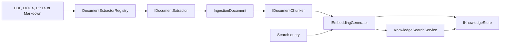

# MafPlayground.Retrieval

Provider- and persistence-neutral document ingestion and semantic retrieval core.
It contains deterministic application services and ports; it does not know about
MAF agents, DevUI, PostgreSQL entities, or a concrete embedding provider SDK.

## Architecture



## Main contracts and services

| Component | Responsibility |
| --- | --- |
| `IDocumentExtractor` | Resolves repository diagnostics around a structured `IngestionDocument`. |
| `DocumentExtractorRegistry` | Resolves exactly one extractor by normalized extension. |
| `PdfDocumentExtractor` | Repository implementation of `IngestionDocumentReader` using PdfPig word, block, and reading-order analysis; preserves pages and reports pages that need OCR. |
| `DocxDocumentExtractor` | Native Open XML reader that maps headings, paragraphs, lists, and tables into `IngestionDocument`. |
| `PptxDocumentExtractor` | Native Open XML reader that creates one section per slide and maps titles, text shapes, and tables. |
| `MarkdownDocumentExtractor` | Adapts the DataIngestion Markdig reader without flattening its `IngestionDocument`. |
| `MicrosoftDataIngestionDocumentChunker` | Creates token-bounded chunks per source section while preserving page/section metadata. |
| `IEmbeddingGeneratorProvider` | Provider adapter port that creates an embedding generator and declares the tokenizer for each model. |
| `EmbeddingProviderRegistry` | Resolves `provider:model` embedding selections. |
| `KnowledgeBaseCatalog` | Validates named knowledge bases, embedding identities, and ingestion policies. |
| `IKnowledgeSearchFactory` | Creates a search service bound to one knowledge base and one agent search policy. |
| `IKnowledgeStore` | Persistence port for document state, metadata, atomic replacement, and filtered vector search. |
| `KnowledgeIngestionService` | Hashes, extracts, chunks, embeds, validates, and stores a document explicitly. |
| `IKnowledgeSearch` / `KnowledgeSearchService` | Embeds queries and performs configured semantic search. |

## Registration

```csharp
KnowledgeBaseCatalog catalog = new(catalogOptions);
services.AddRetrievalCore(catalog);
```

The host builds `KnowledgeBaseCatalogOptions` from its configuration and must
additionally register at least one `IEmbeddingGeneratorProvider` and one
`IKnowledgeStore`. The CLI currently uses Ollama and PostgreSQL/pgvector.

## Ingestion invariants

- Source IDs are file names or normalized paths relative to an optional source
  root; absolute machine paths are not used as citations.
- Content hash, embedding identity, chunking identity, and normalized document
  metadata make unchanged ingestion idempotent.
- Embeddings are generated in batches and vector dimensions are checked.
- A document replacement is delegated to the store as one logical operation.
- Unsupported formats and empty extraction are explicit outcomes.
- Caller cancellation propagates through file reads, extraction, embeddings, and
  persistence.

## Configuration ownership

| Knowledge-base option | Default |
| --- | ---: |
| `EmbeddingDimensions` | `768` |
| `Ingestion:MaxTokensPerChunk` | `400` |
| `Ingestion:OverlapTokens` | `40` |
| `Ingestion:EmbeddingBatchSize` | `16` |
| `Ingestion:MaxFileBytes` | `20971520` |
| `Ingestion:MaxDocumentSections` | `1000` |
| `Ingestion:MaxExtractedCharacters` | `2000000` |

`Collection` and `EmbeddingModel` are required for every named knowledge base.
The selected embedding provider owns the tokenizer and its versioned identity;
tokenizer selection is not knowledge-base configuration.
Search settings are supplied by the consuming agent:

| Search option | Default |
| --- | ---: |
| `TopK` | `5` |
| `MinimumSimilarity` | `0.65` |
| `MaximumQueryCharacters` | `2000` |
| `MetadataFilters` | Empty |

The RAG agent separately owns `MaximumAdditionalSearches` because it controls
model-selected refinement rather than storage search.

When ingestion receives a source root, both the lexical file path and final
symbolic-link target must remain below it. Resource limits are checked before
embedding and persistence.

## Extending formats and storage

Markdown is supported through the DataIngestion Markdig reader. DOCX and PPTX
use repository-owned `IngestionDocumentReader` implementations over the Open XML
SDK; they do not require Microsoft Office, MarkItDown, Python, or MCP. Add another
format or OCR by implementing `IngestionDocumentReader` and registering it behind
the repository extraction boundary; no ingestion or agent change is required.
Add another vector database by implementing `IKnowledgeStore` and, when
migrations are needed, `IRetrievalDatabaseInitializer` in an infrastructure
project.

The native Office readers intentionally support `.docx` and `.pptx`, not the
legacy binary `.doc` and `.ppt` formats. DOCX citations use logical headings
because pagination is a rendering concern. PPTX citations use slide numbers.
Images, charts, and speaker notes are currently reported as warnings rather than
silently treated as extracted text.

Retrieved documents are untrusted input. Agents must inject them as data and
enforce authorization before constructing metadata filters when tenant or ACL
support is added. Filters use normalized lowercase keys, exact case-sensitive
string values, and AND semantics. Model-selected refined searches reuse the same
bound filters and cannot widen their scope.

## Tests

Deterministic tests cover model selection, registry conflicts, PDF, DOCX, PPTX,
and Markdown extraction, Office structure surviving token chunking, token chunk
boundaries, source metadata, ingestion skipping, embedding
validation, and search contracts. Store round trips belong in integration tests.
See `docs/rag-data-ingestion-spike.md` for the spike findings and migration plan.
